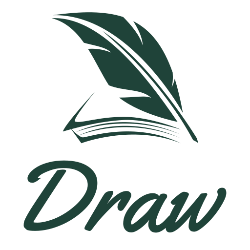

	

<h2 align="center">Draw Board - A Vue3 + Vite Drawing board</h2>

	

- Vue3
- TypeScript
- rought.js
- vite
- unocss
- vueuse

## Usage
mouse click, move, and release events, you can draw rectangles, ellipses, lines, and arrows in canvas, or you can use freeDraw, which is a bit like arbitrary drawing with a stylus.

## Getting Started

### Clone repository

~~~shell
git clone https://github.com/xing403/draw-board.git
# or
git clone git@github.com:xing403/draw-board.git
~~~

### Installation dependency

- Nodejs > = 16 is required

~~~shell
pnpm install
~~~

### Running

~~~shell
pnpm run dev
~~~

